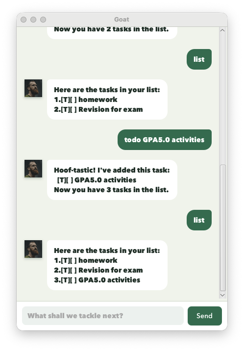

# Goat User Guide



Goat is a desktop task manager with a friendly, sure-footed chatbot personality.
It helps you keep track of todos, deadlines, and events using short text commands.
Your tasks are saved automatically, so they are available the next time Goat starts.

## Quick start

1. Ensure that Java 25 is installed.
2. Download `goat.jar` from the latest GitHub release.
3. Put `goat.jar` in the folder where you want Goat to store its data.
4. Open a terminal in that folder.
5. Run:

   ```shell
   java -jar goat.jar
   ```

6. Type a command into the input box and press **Enter**, or click **Send**.

> **Tip:** Enter `bye` when you are finished, or close the window normally.

## Understanding the task list

Each task begins with a type and completion marker:

- `[T]` — todo
- `[D]` — deadline
- `[E]` — event
- `[ ]` — incomplete task
- `[X]` — completed task

For example, `[D][X] submit report (by: Oct 15 2026)` is a completed
deadline.

Task numbers begin at `1`. Commands such as `mark`, `unmark`, and `delete` use
the numbers currently shown by `list`. Run `list` again after deleting or
sorting because the task numbers may have changed.

## Command summary

| Action | Command format | Example |
| --- | --- | --- |
| Add a todo | `todo DESCRIPTION` | `todo read chapter 3` |
| Add a deadline | `deadline DESCRIPTION /by YYYY-MM-DD` | `deadline submit report /by 2026-10-15` |
| Add an event | `event DESCRIPTION /from YYYY-MM-DD /to YYYY-MM-DD` | `event project meeting /from 2026-10-10 /to 2026-10-11` |
| List all tasks | `list` | `list` |
| Find tasks | `find KEYWORD` | `find report` |
| Sort tasks | `sort` | `sort` |
| Mark a task | `mark NUMBER` | `mark 2` |
| Unmark a task | `unmark NUMBER` | `unmark 2` |
| Delete a task | `delete NUMBER` | `delete 2` |
| Exit Goat | `bye` | `bye` |

Command words must be lowercase. Replace uppercase placeholders such as
`DESCRIPTION`, `KEYWORD`, and `NUMBER` with your own values.

## Adding a todo

Use `todo` for a task without a date.

Format:

```text
todo DESCRIPTION
```

Example:

```text
todo read chapter 3
```

Goat adds an incomplete todo:

```text
[T][ ] read chapter 3
```

The description cannot be empty. Extra spaces inside the description are
treated as a single space.

## Adding a deadline

Use `deadline` for a task that must be completed by a specific date.

Format:

```text
deadline DESCRIPTION /by YYYY-MM-DD
```

Example:

```text
deadline submit report /by 2026-10-15
```

Goat displays the date in a friendlier format:

```text
[D][ ] submit report (by: Oct 15 2026)
```

Use exactly one `/by` marker. The date must be a real calendar date in
`YYYY-MM-DD` format. For example, `2026-02-30` is rejected.

## Adding an event

Use `event` for an activity that takes place over a date range.

Format:

```text
event DESCRIPTION /from START_DATE /to END_DATE
```

Example:

```text
event project meeting /from 2026-10-10 /to 2026-10-11
```

Result:

```text
[E][ ] project meeting (from: Oct 10 2026 to: Oct 11 2026)
```

Use exactly one `/from` and one `/to` marker. Both dates must use
`YYYY-MM-DD`, and the start date must be earlier than the end date.

## Listing tasks

Enter:

```text
list
```

Goat shows every task with its current task number:

```text
Here are the tasks in your list:
1.[T][ ] read chapter 3
2.[D][ ] submit report (by: Oct 15 2026)
3.[E][ ] project meeting (from: Oct 10 2026 to: Oct 11 2026)
```

## Marking and unmarking tasks

Mark a task as completed:

```text
mark NUMBER
```

Example:

```text
mark 2
```

The completion marker changes from `[ ]` to `[X]`.

Mark a completed task as incomplete again:

```text
unmark NUMBER
```

Example:

```text
unmark 2
```

## Deleting a task

Format:

```text
delete NUMBER
```

Example:

```text
delete 2
```

Goat removes the selected task permanently and renumbers the remaining tasks.

## Finding tasks

Format:

```text
find KEYWORD
```

Example:

```text
find report
```

Goat shows tasks whose descriptions contain the supplied text. Searching is
case-sensitive, so `report` and `Report` are different searches. The numbers
in search results are local to those results; run `list` before using a task
number with `mark`, `unmark`, or `delete`.

## Sorting tasks

Enter:

```text
sort
```

Goat arranges tasks using these rules:

1. Dated tasks come before undated todos.
2. Deadlines use their due date.
3. Events use their start date.
4. Earlier dates come first.
5. Tasks with the same date are ordered alphabetically by description.
6. Todos are ordered alphabetically after all dated tasks.

Sorting preserves completion status and saves the new task order.

## Exiting Goat

Enter:

```text
bye
```

Goat displays its farewell and closes the application. You can also close the
window using the normal window controls.

## Input errors

Goat highlights invalid commands in red and explains how to correct them.
Common errors include:

- leaving a description, keyword, date, or task number empty;
- entering a task number that does not exist;
- entering text instead of a task number;
- using an invalid calendar date;
- repeating `/by`, `/from`, or `/to`;
- using an event end date that is the same as or earlier than its start date;
- adding extra arguments to commands such as `list`, `sort`, or `bye`; and
- entering an unsupported command word.

An invalid command does not change the task list. Correct the command using
the formats above and try again.

## Saving data

Goat saves tasks automatically after commands that change their state or
order. It stores them in:

```text
data/goat.txt
```

The `data` folder is created beside `goat.jar`, relative to the folder from
which Goat is launched. Avoid editing `goat.txt` manually. If Goat cannot read
the file, it displays a warning and starts with an empty task list.

## Command examples to try

```text
todo prepare slides
deadline submit report /by 2026-10-15
event project meeting /from 2026-10-10 /to 2026-10-11
list
mark 1
find report
sort
bye
```
